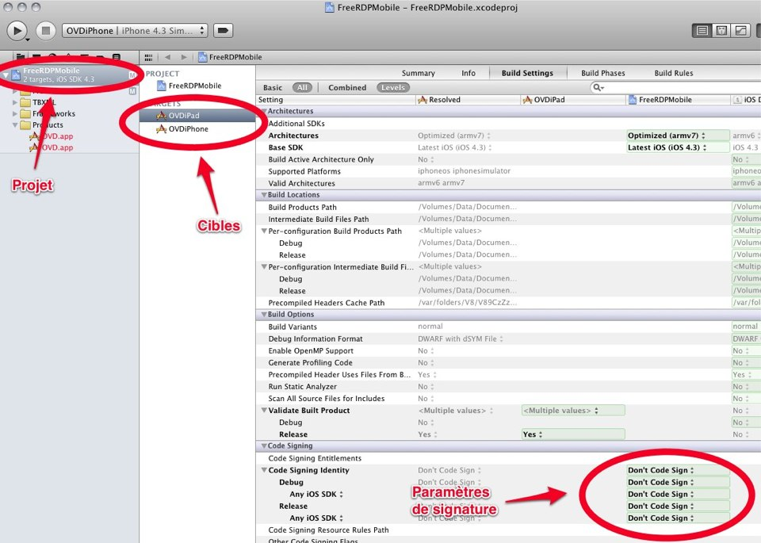
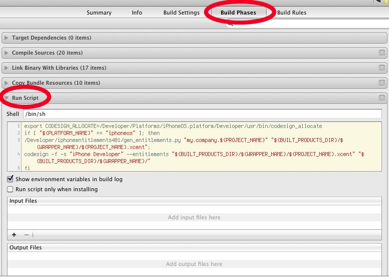

Compilation
===========

Le projet de l'application iOS se trouve dans le répertoire FreeRDPMobile. Ce
projet dépend des bibliothèques statiques suivantes :

- FreeRDP
- GnuTLS-for-iOS (libgcrypt.a)
- OpenSSL-for-iPhone (libcrypto.a, libssl.a) 
 
Ces deux derniers projets ne sont pas amené à être modifiés. Ils pourront
éventuellement être mis à jour s'il y a besoin.

Spécificités
------------

Les bibliothèques fournies sont toutes compilées pour deux architectures de
processeurs différentes : i386 pour le simulateur et arm pour les périphériques
(iPad, iPhone, iPod Touch). Elles sont d'abord compilées séparément puis
assemblées à l'aide de la commande ``/usr/bin/lipo``. 

FreeRDP
-------

Les bibliothèques fournies par FreeRDP sont actuellement :

- noyau
    - libfreerdp.a
    - libfreerdpchanman.a
    - libfreerdpkbd.a
    - libfreerdputils.a
    - libgdi.a
- rdpsnd
    - rdpsnd.a
- rdpdr 
    - rdpdr.a
    - printer.a
- cliprdr
    - cliprdr.a

La compilation de FreeRDP s'appuie sur les autotools, Deux scripts ont donc été
réalisé pour passer les bons paramètres au ``configure`` :

- ``build-iphonesim-4.3``
- ``build-iphone-4.3``

Ces scripts compilent les bilbiothèques et les places dans les dossiers
suivants: 

- ``libios/arm``
- ``libios/i386``

Dans le cas d'un changement de SDK, il faut penser à modifier les constantes
qu'ils contiennent pour référencer le bon chemin.

``buildlibios.py`` s'occupe d'appeler successivement les deux scripts
précédents et d'assembler les bibliothèques des deux architectures en un seul
fichier. 

Les bibliothèques sont disponibles dans le dossier ``libios`` et sont
directement référencé par le projet Xcode.

Lors d'une modification du code de FreeRDP qui ne comprend pas l'ajout d'un
nouveau module, une seule commande suffit pour générer à nouveau les
bibliothèques ::

    ./buildlibios.py -a

Si de nouveaux plugins doivent être inclus dans le projet Xcode, il faut
modifier le script ``buildlibios.py`` pour intégrer la fusion des deux
architectures et la copie du fichier final dans le répertoire ``libios``. De là
il pourra être référencé par Xcode.

Il est à noter que le fichier ``configure.ac`` a été modifié aux environs de la
ligne 250 afin de permettre la compilation de la bibliothèque gérant
l'impression. Une option ``ios`` a été ajoutée. 

FreeRDPMobile
-------------

La compilation de projet est entièrement dépendante d'Xcode. 

Xcode organise sa compilation autour de cibles (OVDiPad, OVDiPhone) qui
permettent de compiler deux produits séparés. 

La fenêtre de configuration des paramètres du projet est accessibles en cliquant
sur le nom du projet dans la barre de gauche. Les paramètres de la cible
sélectionnée s'affichent alors dans le tableau à droite.

Le tableau comprend 4 colonnes qui sont droite à gauche, les paramètres par
défaut pour les développements iOS, les paramètres du projet, les paramètres de
la cible et enfin les paramètres déduits de toutes les autres colonnes.

La barre d'outil rappelle la cible sélectionnée et la destination du programme.
Ici, la cible est OVDiPhone et le programme se lancera avec le simulateur.

Il n'est pas nécessaire de passer par Xcode pour compiler le code. Il existe la
commande ``xcodebuild`` qui est dédiée à cette tâche. Pour compiler
l'application ::

    xcodebuild -target <target> -configuration <confiration> -sdk <sdk>

Target (target disponibles ``xcodebuild -list``) :

- OVDiPad
- OVDiPhone

Configuration (configuration disponibles ``xcodebuild -list``) :

- Debug
- Release

SDK (sdk disponibles ``xcodebuild -showsdks``) :

- iphoneos4.3
- iphonimulator4.3

L'application est dans ce cas le fichier ``OVD.app``  qui se trouve dans le répertoire ::

    build-ipad/<configuration>-<sdk>
    build-iphone/<configuration>-<sdk>

Dans la cas de la compilation de l'application pour iPad pour le périphérique en
mode Release, la commande serait ::

    xcodebuild -target OVDiPad -configuration Release -sdk iphoneos4.3

et le résultat de la compilation serait disponible à l'endroit suivant ::

    build-ipad/Release-iphoneos

Distribution de l'application
~~~~~~~~~~~~~~~~~~~~~~~~~~~~~
Actuellement les applications sont compilées et signées de manière incomplètes
grâce à un script qui est exécuté à la fin de la compilation.

Pour chacune des cibles, il faudrait alors désactiver ce script et choisir
l'identité du développeur qui effectue cette signature dans les paramètres
*Build Settings* (comme indiqué dans la première capture).
